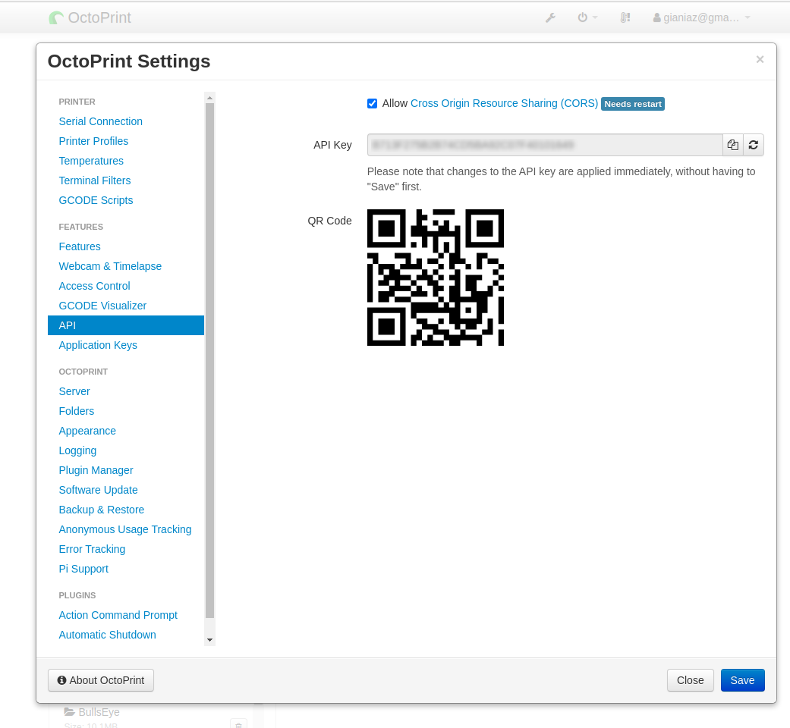

# OCTOKEYBOARD

Software for attacching an external keyboard for a 3d printer managed by Octoprint.

This software is made of two parts:

- CLIENT
- SERVER

The client is an arduino nano listening for phisical button push, when a push event occurr a string code is sent to the rapsberry running the server through serial connection 
(USB cable connectetd from arduino nano to an usb port of the raspberry)

## PREREQUISITES

- A running (and working) instance of octoprint on a raspberry pi
- This software
- The keyboard

## CLIENT

A simple keyboard created using this hardware:

- <a href="https://s.click.aliexpress.com/e/_dYnCO6a" target="_parent">Arduino NANO</a>
- <a href="https://s.click.aliexpress.com/e/_d6akhfg" target="_parent">Push Buttons</a>
- <a href="https://s.click.aliexpress.com/e/_d8LLEQi" target="_parent">Cables</a>
- <a href="https://s.click.aliexpress.com/e/_dVWQbBo" target="_parent">M2 screws</a>

And a 3d printer obviously!

Link to the 3d Printer project here:

(stl files are alse included in this repo under stl directory)

When assembled you have to upload the keyboard.ino sketch file (under client directory)

## SERVER

The server is a python script listening on the serial port which the keyboard is connected to (you can configure it in config.ini file)
When a command is received it checks if the connection to from octoprint to the printer is active, if not it tries to connect to send the command attached to the button you have clicked.

The server communicates with octoprint through octoprint API, to make it work you have to generate an api key on octoprint and then copying the value to the config.ini file. 

### CONFIG

Inside the server directory you can find a file called config.ini.dist, copy it to config.ini and adjust to your needs 
(for example you can attach the keyboard on another computer in the lan, then you have to adjust the server host)

### AUTOSTART

If you want the server to be started automatically at raspberry startup you can copy the file inside etc/init.d/ into your /etct/init.d/ directory. 

Then you can start manually (as super user) with this command: 

`/etc/init.d/octo-keyboard start`

or you can launch only one time this command for start as a default at boot:

`update-rc.d /etc/init.d/octo-keyboard defaults`

